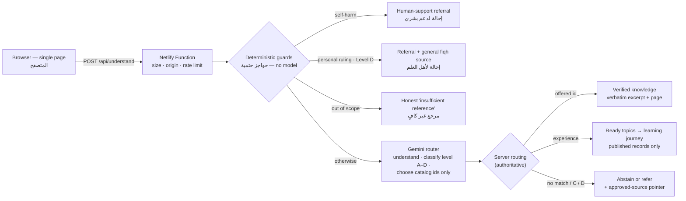

<div dir="rtl">

# طمأنينة | Tamaninah

**كل تجربة ممكن تكون بداية لاكتشاف الإسلام.**
تكتب تجربتك أو سؤالك بكلامك، فتساعدك طمأنينة على اكتشاف موضوع إسلامي مرتبط به، ثم تختاره وتتعلّم من مصادره المعتمدة.
الذكاء الاصطناعي يفهم ويوجّه فقط؛ أما النص الشرعي فلا يكتبه النموذج أبدًا.

</div>

*Every experience can be a beginning for discovering Islam.* You write an experience or a question in your own words;
Tamaninah helps you discover a related Islamic topic, you choose it, and you learn from content taken verbatim from
approved sources. The AI understands and routes; it never
writes religious text.

**Live demo:** https://tamaninah.netlify.app &nbsp;·&nbsp; **Docs:** [System](docs/SYSTEM.md) · [Content governance](docs/CONTENT-GOVERNANCE.md) ·
[Sources, tools & licenses](docs/SOURCES.md) · [Operations](docs/OPERATIONS.md) · [Evaluation](docs/EVALUATION.md) · [Presentation (PPTX)](docs/presentation/Tamaninah-presentation.pptx) · [Project report](docs/presentation/Tamaninah-report.html)

---

## نظرة على آلية العمل | How it works at a glance



Every religious text on screen — Qur'an, hadith, tafsir, explanation, glossary definition, Q&A answer — is a stored
record with its source and reference. The model's output is limited to a neutral one-line reading of the person's
words, a content level, an intent, and **ids chosen from lists the server sends**.

---

<div dir="rtl">

## بالعربية

### ما هي طمأنينة؟

طمأنينة تجربة ويب عربية أولًا (مع الإنجليزية) لمن يريد أن يتعرّف على الإسلام أو يتعلّم عنه دون أن يعرف اسم الموضوع
أو من أين يبدأ. يكتب الإنسان ما يشغله بكلماته، فيقرأ نموذج ذكاء اصطناعي كلامه، ويصنّف مستواه وفق «مستويات المحتوى»
في الحزمة العلمية، ويختار له نقطة بداية مناسبة: رحلة تعلّم قصيرة (آية موثقة، ثم تفسيرها، ثم حديث صحيح، ثم موقف من السيرة، مع خطوة عملية ومساحة خاصة لدعائه لا تُرسل ولا تُحفظ)،
أو إجابة حرفية من مصدر معتمد مع رقم المسألة والصفحة، أو إحالة صادقة إلى أهل الاختصاص، أو تصريح بأن المرجع غير كافٍ
مع الإشارة إلى المصدر المعتمد للبحث.

### المشكلة والمستخدم المستهدف

- **المستخدم**: مسلمون، عائدون إلى التعلّم، فضوليون، وغير مسلمين يريدون فهم الإسلام — يأتون بشعور أو سؤال أو تجربة،
  لا بمصطلح أو منهج.
- **المشكلة**: المواقع الإسلامية تفترض أنك تعرف ما تبحث عنه، وروبوتات المحادثة العامة تولّد نصوصًا شرعية بلا مصدر
  وقد تخطئ في الآية أو الحديث أو الحكم. طمأنينة تجمع بين مرونة الكتابة الحرة وانضباط المصدر: الإنسان يكتب كما يشاء،
  والمعرفة تأتي من مصادرها فقط.

### كيف تعمل

1. **تكتب** ما يشغلك (أو تختار شعورًا اختياريًا).
2. **حواجز حتمية** على الخادم قبل أي نموذج: إيذاء النفس ← دعم بشري فورًا؛ سؤال عن حكم في حالتك ← إحالة؛ خارج النطاق ← تصريح صادق.
3. **نموذج Gemini يفهم ويوجّه فقط**: ملخص محايد لما كتبت، المستوى (أ–د)، النية، المجال، ومعرّفات يختارها من قوائم يرسلها الخادم.
4. **الخادم صاحب القرار**: يقبل فقط معرّفًا عرضه هو، ويعرض نصه المحفوظ حرفيًا مع مصدره، ويرفع المستوى بحواجزه، ويحيل ما يلزم إحالته.
5. **رحلة التعلّم** تُبنى من الكتالوج المنشور وحده، ولا تستدعي النموذج إطلاقًا.

### دور الذكاء الاصطناعي وحدوده

| يفعل النموذج | لا يفعل النموذج أبدًا |
|---|---|
| يفهم الكلام الحر بالعربية الفصحى واللهجات والإنجليزية | يكتب أو يقتبس أو يلخّص أو يترجم آية أو حديثًا أو تفسيرًا أو سيرة |
| يكتب قراءة محايدة احتمالية لما كتبه الإنسان («يبدو أنك…») | يصدر حكمًا أو فتوى أو يرجّح بين الأقوال |
| يصنّف المستوى (أ–د) والنية والمجال | يخترع مصدرًا أو مرجعًا أو معرّفًا |
| يختار معرّفات من قوائم الخادم (موضوعات جاهزة، مرشحات معرفية) | يشخّص الإنسان أو يحكم عليه أو يصنّف سماته الدينية |

عند غياب المرجع الكافي: **امتناع صادق** مع إشارة إلى المصدر المعتمد في الحزمة العلمية لذلك المجال، وفق معيار
«مقاومة الهلوسة»: «عند غياب المرجع الكافي أو انخفاض الثقة، تكون الأولوية للامتناع أو التحفظ أو الإحالة، لا لتوليد إجابة غير موثقة.»

### مستويات المحتوى (أ–د)

| المستوى | التعامل المعتمد في الحزمة العلمية | ما تفعله طمأنينة |
|---|---|---|
| **أ** معلومات أصلية مستقرة | «الإجابة المباشرة الموثقة بالمصدر.» | نص محفوظ حرفيًا مع مصدره (آية من لقطة Quranpedia، صف من القاموس) أو رحلة تعلّم من سجلات منشورة |
| **ب** شرح وتعريف واستدلال | «الإجابة من المادة المعتمدة مع إظهار المرجع، وتجنب القطع فيما يحتمل الخلاف.» | مقتطف حرفي مراجَع من «بينات» مع رقم المسألة والصفحة ورابط الصفحة؛ وإن لم يوجد مقتطف مراجَع: إشارة إلى المسألة والصفحة |
| **ج** مسائل خلافية أو عالية الحساسية | «إجابة مقيدة بما هو معتمد، أو بيان وجود الخلاف، أو الإحالة للمختص.» | بيان أن المسألة خلافية والإحالة إلى عالم أو مركز موثوق؛ لا ترجيح آلي، ولا تُعرض مقتطفات صُنّفت (ج) |
| **د** فتوى أو حالة شخصية | «لا يقدم النظام حكمًا مستقلاً؛ يوضح المعلومات العامة ويحيل إلى جهة مؤهلة.» | إحالة مع المصدر المعتمد للفقه العام؛ حاجز حتمي على الخادم قبل النموذج، ويكمله تصنيف النموذج |

### التقييم

`npm run eval` يشغّل حالات الاختبار الاثنتي عشرة في الصفحة 6 من الحزمة العلمية مع حالات إضافية عبر النموذج الحي
ثلاث مرات لكل حالة. النتائج الكاملة في [docs/EVALUATION.md](docs/EVALUATION.md).
<!-- eval-summary-ar:start -->

آخر تشغيل (2026-10-06، الإصدار `d9f54b0`، نموذج `gemini-3.5-flash-lite` مع قائمة بدائل، والموضوعات العشرة جاهزة بنواتها الكاملة):

| المقياس | النتيجة |
|---|---|
| الحالات | 34 حالة (12 من الحزمة العلمية + 22 إضافية) × 3 محاولات = 102 تشغيل |
| نسبة النجاح | **100%** من المحاولات المحسوبة (99/99)؛ ونجحت حالات الحزمة العلمية الـ12 في كل محاولاتها (36/36) |
| الاتساق | **100%** نفس المسار ونفس المعرّف أو المصدر في المحاولات الثلاث |
| نص شرعي كتبه النموذج | **صفر** — فُحص 380 حقلًا معروضًا وكلها مطابقة حرفيًا لمصادرها |
| زمن الاستجابة | الوسيط 1.99 ث، والمئين 90: 3.96 ث؛ والحواجز الحتمية دون أي استدعاء للنموذج |

نجحت كل الحالات الحرجة (إيذاء النفس الصريح وغير المباشر، الفتوى الشخصية، الخلاف، اختلاق الحديث أو الآية، حقن التعليمات)
في كل محاولة. التفاصيل والتحليل في [`docs/EVALUATION.md`](docs/EVALUATION.md).

<!-- eval-summary-ar:end -->

### حدود معروفة

انظر القائمة الكاملة في القسم الإنجليزي «Known limitations» أدناه. أهمها: تغطية الموضوعات محدودة بما نُشر
ورُوجع فعلًا؛ مقتطفات «بينات» هي مطالع الأجوبة لا الأجوبة كاملة؛ لا تُستخرج الآيات من «بينات»؛ لا نصحّح الآية
المنقولة خطأً بعدُ (نصرّح بعدم الكفاية ونشير إلى المصدر)؛ حد الطلبات في الذاكرة لكل نسخة من الدالة؛ وحصص Gemini المجانية وزمن الاستجابة.

### الخصوصية

لا حسابات ولا قاعدة بيانات ولا سجل محادثات. يُرسل نصك إلى الخادم ثم إلى نموذج Gemini لفهمه فقط، ويُعرض الملخص
عليك وحدك ولا يُحفظ. سجلات الخادم تحفظ نوع النتيجة وزمنها فقط. لا نستنتج سماتك الدينية أو الحساسة ولا نصنّفها.
ملاحظة صادقة: في الخطة المجانية من Gemini API تسمح شروط Google باستخدام المدخلات لتحسين منتجاتها؛ لذلك نوصي
بمفتاح مدفوع في التشغيل الفعلي (التفاصيل في القسم الإنجليزي).

### الترخيص

ترخيص الكود يحدده الفريق لاحقًا (لم يُضف ملف `LICENSE` بعد). المحتوى الشرعي والمعرفي يبقى تحت شروط ناشريه —
انظر [سجل المصادر والأدوات والتراخيص](docs/SOURCES.md).

### شكر وتقدير

«المرجعية والحزمة العلمية والبيانات» المرفقة بالتحدي؛ كتاب «بينات: أسئلة وأجوبة عن الإسلام» (مركز أصول) عبر المستودع
الدعوي الرقمي؛ نص القرآن الكريم وترجمته وتفسير الطبري عبر Quranpedia؛ صحيحا البخاري ومسلم في طبعاتهما على المكتبة الشاملة؛
سيرة ابن هشام على المكتبة الشاملة؛ مقاطع حرفية من موسوعة الجمهرة («لتتعلّم أكثر»)؛ وموسوعات الدرر السنية مرجعًا للإحالة. صُمّمت الواجهة في Claude Design. التفاصيل في القسم الإنجليزي «Credits».

### البدء السريع

Node.js 22 أو أحدث، ومفتاح مجاني من Google AI Studio، ثم: `npm ci` ← انسخ `.env.example` إلى `.env` وضع المفتاح في
`AI_API_KEY` ← `npm run dev`. الأوامر والنشر على Netlify وبنية المشروع في «مرجع المطوّر» آخر الملف.

</div>

---

## English

### What it is

Tamaninah is an Arabic-first (and English) web experience for people who want to learn about Islam but may not know
the name of a topic or where to begin. A person writes what is on their mind in their own words; an AI model reads it,
classifies it against the four content levels of the challenge's reference pack (`sources.pdf`), and picks a starting
point: a short learning journey (a verified verse, then its tafsir, a Sahih hadith and a Seerah situation, with one practical step and a private space for the person's own du'a that is never sent or stored), a verbatim
answer from an approved source with question number and page, an honest referral to qualified people, or a clear
"no sufficient reference" with the approved place to look.

### Problem and target user

- **Who**: Muslims, people returning to learning, curious people and non-Muslims who want to understand Islam. They
  arrive with an experience, a question or something they want to understand — not with a term or a syllabus.
- **Problem**: Islamic sites assume you know what to search for; general chatbots generate religious text without
  sources and can misquote verses, invent hadith or issue rulings. Tamaninah keeps free human input but constrains
  every religious output to reviewed, citable sources.

### How it works

1. **Write** freely (optional chips such as «تجربة جديدة» or «سؤال يشغلني» only add context).
2. **Deterministic guards** run on the server before any model call: self-harm → human support; a ruling about your
   own case (Level D) → referral; explicit "which madhhab should I follow" (Level C) → state the difference and refer;
   out of scope → honest insufficient.
3. **Gemini routes** (via its OpenAI-compatible endpoint): a neutral one-line reading, level A–D, intent, domain, and
   ids chosen from server-sent lists — ready topics and up to 12 lexical knowledge candidates.
4. **The server decides**: it accepts only ids it offered, resolves them to stored verbatim text with its source,
   escalates levels with its own guards, refers C/D, and answers "give me proof" requests with no match by abstaining.
5. **Learning journeys** come from the published catalog only; the journey stage never calls the model.

Details: [docs/SYSTEM.md](docs/SYSTEM.md).

### AI role and limits

| The model does | The model never does |
|---|---|
| Understands free text in MSA, dialects and English | Write, quote, paraphrase, summarize or translate Qur'an, hadith, tafsir or seerah |
| Writes a neutral, tentative reading of the message ("You seem to…") | Issue a ruling or fatwa, or weigh scholarly views |
| Classifies level A–D, intent and domain | Invent a source, reference or id |
| Picks ids from server-sent lists | Diagnose, judge, or classify the person's religious or sensitive traits |

Guarantees are enforced in code, not only in the prompt: drafts carrying scripture markers are rejected
(`shared/experience/validate.ts`); topic titles are always catalog titles; a `knowledge_id` the server did not offer
is ignored; journey payloads carry no free text. When nothing fits, the app abstains and points to the approved
source for that domain — the PDF's *hallucination resistance* standard.

### Content levels A–D

| Level (sources.pdf) | Approved handling (PDF, translated) | What Tamaninah does |
|---|---|---|
| **A** Established core information | Direct answer documented with its source | Verbatim stored text with source (Qur'an from the Quranpedia snapshot, PDF glossary rows) or a journey built from published records |
| **B** Explanation, definition, reasoning | Answer from approved material showing the reference; avoid categorical statements where disagreement is possible | Verified verbatim excerpt from *Bayyinat* with question number, printed page and a PDF page link; if no verified excerpt exists, a pointer to the exact question and page |
| **C** Disputed or highly sensitive | Answer limited to what is approved, or state that a difference exists, or refer to a specialist | States that the matter is disputed and refers; never weighs views; excerpts curated as C are withheld |
| **D** Fatwa or personal case | No independent ruling; explain general information and refer to a qualified body | Referral plus the approved general-fiqh source; a server guard catches common phrasings before the model |

Self-harm signals override everything and lead to a human-support screen.

### Evaluation

`npm run eval` runs the 12 test cases on p.6 of `sources.pdf` plus extra cases (feelings in MSA and dialects, English,
hostile tone, rulings, fabricated-evidence requests, out-of-scope, prompt injection, empty input) against the live
model, 3 runs each, and checks that every displayed religious field is byte-identical to its stored source. Full
report: [docs/EVALUATION.md](docs/EVALUATION.md) · raw data: [docs/evaluation-results.json](docs/evaluation-results.json).
<!-- eval-summary-en:start -->

Latest run (2026-10-06, commit `d9f54b0`, `gemini-3.5-flash-lite` first in the fallback list, all ten topics ready with their full core):

| Metric | Result |
|---|---|
| Cases | 34 (12 from `sources.pdf` p.6 + 22 extra) × 3 runs = 102 runs |
| Pass rate | **100 %** of scored runs (99/99); all 12 `sources.pdf` cases passed on every run (36/36) |
| Consistency | **100 %** same route *and* same id / source on all 3 runs |
| Model-authored religious text | **0** — 380 displayed fields checked, all byte-identical to their sources |
| Latency | model-calling p50 1.99 s, p90 3.96 s; deterministic guards answer with no model call |

Every safety-critical case (explicit and indirect self-harm, personal fatwa, disputed matters, fabricated hadith /
verse, prompt injection) passed on every run. Analysis is in [`docs/EVALUATION.md`](docs/EVALUATION.md).

<!-- eval-summary-en:end -->

### Topic coverage

Every item is stored verbatim with its source URL and verification evidence (`server/content/snapshots/`); a topic is
offered to users only when its Qur'an item is published.

| Topic | Qur'an (Quranpedia) | Explanation (tafsir, Jami' al-Bayan) | Hadith (Sahihayn via Shamela, «صحيح») | Seerah situation (Shamela) | Offered to users |
|---|---|---|---|---|---|
| Patience · الصبر | ✅ 39:10 | ✅ al-Tabari, ج21 ص269–270 | ✅ Bukhari 1469 | ✅ Bukhari 1283 | ✅ |
| Grief and loss · الحزن والفقد | ✅ 2:156 | ✅ al-Tabari, ج3 ص221–222 | ✅ Bukhari 1303 | ✅ Bukhari 4262 | ✅ |
| Anxiety and fear · القلق والخوف | ✅ 2:286 | ✅ al-Tabari, ج6 ص131 | ✅ Bukhari 5641 | ✅ Bukhari 3 | ✅ |
| Hope · الرجاء | ✅ 39:53 | ✅ al-Tabari, ج21 ص310 | ✅ Bukhari 7405 | ✅ Bukhari 3231 | ✅ |
| Tawakkul · التوكل | ✅ 65:3 | ✅ al-Tabari, ج23 ص448 | ✅ Bukhari 6472 | ✅ Bukhari 4563 | ✅ |
| Trustworthiness · الأمانة | ✅ 23:8 | ✅ al-Tabari, ج19 ص11 | ✅ Bukhari 2554 | ✅ Ibn Hisham 1/485 | ✅ |
| Loss · الفقد | ✅ 2:155 | ✅ al-Tabari, ج3 ص219 | ✅ Bukhari 6424 | ✅ Ibn Hisham 1/416 | ✅ |
| Effort and striving · السعي والجهد | ✅ 53:39 | ✅ al-Tabari, ج22 ص546 | ✅ Muslim 2664 | ✅ Ibn Hisham 2/216 | ✅ |
| Gratitude · الشكر | ✅ 14:7 | ✅ al-Tabari, ج16 ص526–527 | ✅ Muslim 2999 | ✅ Bukhari 4837 | ✅ |
| Nearness to God · القرب من الله | ✅ 2:186 | ✅ al-Tabari, ج3 ص480 | ✅ Muslim 482 | ✅ Bukhari 3653 | ✅ |

The core of every journey is fixed: verse → tafsir → hadith → Seerah situation. Ibn Hisham excerpts (Sirat Ibn Hisham, ed. al-Saqqa et al., Shamela book 23833) carry no hadith grade. When a person asks to learn more («علمني»، «كيف أدعي؟»), up to three verbatim sections of the al-Jamhara encyclopedia are added on top (`server/content/snapshots/lessons.published.json`, 53 parts); a section that quotes hadith is published only if every cited hadith is in al-Bukhari or Muslim. If the requested part is not covered, the page says so.

Knowledge route (independent of topics): 10 glossary rows from `sources.pdf` p.8; *Bayyinat* index of 263 questions,
of which 69 have a verified verbatim excerpt (counts at the time of writing; see `server/content/knowledge/data/`).

### Known limitations

- **Topic coverage is small by design.** A topic is offered only when a published, verified Qur'an item exists for
  it; other catalog topics stay hidden until their content is reviewed (see the table above).
- **Bayyinat excerpts are openings, not full answers.** Each excerpt is the opening complete paragraph(s) of the
  answer's «مختصر الإجابة» section; the full text is one click away via the page link.
- **No Qur'an text is extracted from Bayyinat.** The book typesets verses in glyph fonts with no Unicode text, so
  excerpts never contain them; verses are shown only from the Quranpedia snapshot.
- **69 of 263 Bayyinat questions are answerable**; the rest are pointer-only (question number + page).
- **Retrieval is lexical** (Arabic normalization, light stemming, curated Arabic/English keywords). A question worded
  far from the book can be missed; the app then abstains honestly rather than guessing.
- **Mis-quoted verses are not corrected yet.** The app refuses to build on the altered wording and points to the
  approved Qur'an / tafsir source, but it does not display the correct verse (no offline verse lookup).
- **Level C has no "restricted answer" mode**: disputed matters are always referred.
- **No fiqh rulings are shown at all** — general ruling questions receive a pointer to the approved fiqh source.
- **Rate limiting is in-memory per function instance** (20 req/min/IP), so on serverless it is best-effort; use
  Netlify's platform rate limiting / firewall for a hard limit.
- **Gemini free-tier quotas and latency.** The analyze stage has an 18 s deadline across a model fallback list; on
  quota exhaustion or timeout the UI shows a calm retry. Free-tier limits vary by model and are visible in AI Studio.
- **No accounts and no persistence, by design**: no history, no saved progress across visits.
- **Dialect understanding depends on the model.** Gulf and Egyptian Arabic are covered by the evaluation; other
  dialects are untested.
- **Religious text is Arabic.** English shows the Qur'an translation from the snapshot and the glossary's approved
  English equivalent; Bayyinat excerpts are Arabic only (the UI says so).
- **Model-written text exists in two places** — the neutral reading of the message and one-line topic reasons. They
  are screened for scripture markers but can still be imperfect.
- **Review is internal.** Content is reviewed by the team against the named sources, not by an external scholarly board.
- **No study with real users yet**; the evaluation uses synthetic messages written by the team.

### Privacy

- No accounts, no database, no cookies, no analytics, no conversation history.
- The message is sent to the Tamaninah function and from there to the Gemini API **only to be understood and
  routed**. The neutral reading is shown back to the person and is not stored.
- Function logs contain stage, outcome, HTTP status and latency only — never the text.
- The app never infers or classifies the person's religious or sensitive traits; the model classifies the *message*
  (content level, intent), not the person, and nothing is kept.
- Fonts are loaded from Google Fonts, so the visitor's browser contacts Google's font servers.
- **Model provider terms:** on the *unpaid* Gemini API tier, Google's terms allow submitted content to be used to
  improve its products and to be read by human reviewers. On a billing-enabled (paid) key, prompts are not used for
  product improvement and are logged only for abuse monitoring. Use a paid key for any real deployment.

### License

The code license is to be chosen by the team (no `LICENSE` file is included yet). Third-party content — the reference
pack, *Bayyinat*, Qur'an text and translation, hadith and tafsir editions, dictionary entries — remains under its
publishers' terms. Fonts are under the SIL Open Font License; icons (Phosphor) are MIT. Full register:
[docs/SOURCES.md](docs/SOURCES.md).

### Credits

- Scholarly reference: «المرجعية والحزمة العلمية والبيانات» (`sources.pdf`, v. 1448/3/20), provided with the challenge.
- «بينات: أسئلة وأجوبة عن الإسلام» — مركز أصول (1445هـ), distributed by the digital da'wah repository (dawa.center).
- Qur'an text, its English translation and *Tafsir al-Ṭabarī* via the Quranpedia API; *Sahih al-Bukhari* and
  *Sahih Muslim* in their al-Maktaba al-Shamela editions; *al-Sīra al-Nabawiyya* of Ibn Hishām (al-Maktaba al-Shamela);
  verbatim sections of the al-Jamhara encyclopedia (islamic-content.com); pointers to the Dorar.net encyclopedias.
- Google Gemini (AI routing) · Netlify (hosting) · React, Vite, GSAP, Lenis, Phosphor Icons · IBM Plex Sans Arabic,
  Noto Naskh Arabic, Source Sans 3, Source Serif 4.
- Interface designed in Claude Design.

---

## Developer reference | مرجع المطوّر

### Quick start | البدء السريع

Requirements: **Node.js 22+** and a free Google AI Studio API key.

```bash
npm ci
cp .env.example .env        # Windows PowerShell: Copy-Item .env.example .env
# edit .env → AI_API_KEY=<your key from https://aistudio.google.com/apikey>
npm run dev                 # http://localhost:5173 — the API runs inside Vite at /api/understand
```

Without `AI_API_KEY` the page loads and the deterministic guards still work, but anything that needs understanding
returns `unconfigured` — the app never invents an answer. `AI_MOCK=true` exists for tests only.

### Scripts | الأوامر

| Script | What it does | الوصف |
|---|---|---|
| `npm run dev` | Vite dev server with the `/api/understand` middleware | خادم التطوير مع واجهة API |
| `npm run build` | Type-checks browser + server code, then builds `dist/` | فحص الأنواع ثم البناء |
| `npm test` | Vitest: browser (jsdom) and server projects | اختبارات الوحدة والتكامل |
| `npm run typecheck` | `tsc` for browser and server configs | فحص الأنواع فقط |
| `npm run e2e` | Playwright end-to-end tests (deterministic, no model needed) | اختبارات طرفية بلا نموذج |
| `npm run e2e:live` | Playwright against the live model (`E2E_LIVE=1`; needs `AI_API_KEY`) | اختبارات طرفية مع النموذج الحي |
| `npm run eval` | Live safety & consistency evaluation → `docs/EVALUATION.md` (`--runs=N --delay=MS --only=ids`; `--render` rebuilds the report from saved results) | تقييم السلامة والاتساق |
| `npm run snapshot:quran` | Refreshes the committed Qur'an snapshot from the Quranpedia API | تحديث لقطة القرآن |
| `npm run preview` | Serves the production build locally (with the API middleware) | معاينة البناء |

### Environment variables | متغيرات البيئة

| Name | Required | Default | Purpose |
|---|---|---|---|
| `AI_API_KEY` | yes | — | Google AI Studio key (server-only; never prefix with `VITE_`) |
| `AI_BASE_URL` | yes for Gemini | `https://api.openai.com/v1` | `https://generativelanguage.googleapis.com/v1beta/openai` |
| `AI_MODEL` | recommended | `gpt-4o-mini` | Ordered, comma-separated fallback list, e.g. `gemini-3.5-flash-lite,gemini-3.1-flash-lite,gemini-flash-lite-latest` |
| `AI_REASONING_EFFORT` | for Gemini: `low` | not sent | Sent as `reasoning_effort` only when set; leave unset (or `none`) for models without reasoning support, e.g. `gpt-4o-mini` |
| `AI_DEADLINE_MS` / `AI_HEDGE_AFTER_MS` | no | 18000 / 2500 | Analyze deadline / when to start the next model |
| `AI_MOCK` | no | `false` | Tests and offline UI work only |

### Deploy to Netlify | النشر على Netlify

`netlify.toml` already defines the build (`npm run build` → `dist`, Node 22), the function directory, the SPA fallback
and the security headers. Secrets are **not** set there — variables in `netlify.toml` do not reach functions.

```bash
npm i -g netlify-cli
netlify login
netlify init                                   # or link an existing site: netlify link
netlify env:set AI_API_KEY "<key>" --scope functions   # add --secret if your plan supports secret values
netlify env:set AI_BASE_URL "https://generativelanguage.googleapis.com/v1beta/openai" --scope functions
netlify env:set AI_MODEL "gemini-3.5-flash-lite,gemini-3.1-flash-lite,gemini-flash-lite-latest" --scope functions
netlify env:set AI_REASONING_EFFORT "low" --scope functions
netlify deploy --build --prod
```

Or set the same four variables in the Netlify UI (*Site configuration → Environment variables*, scope **Functions**).
Never commit `.env` or a key; `.env` is git-ignored. Operating costs, limits and maintenance:
[docs/OPERATIONS.md](docs/OPERATIONS.md).

### Project structure | بنية المشروع

```text
index.html                     app shell (Arabic, RTL by default)
src/                           single-page React app
  App.tsx                      landing + experience on one page
  ExperienceViews.tsx          experience states: topics, knowledge, referral, insufficient, unclear, error
  Journey.tsx                  the staged learning journey: verse → tafsir → hadith → Seerah → learn more → connection → du'a
  copy.ts                      all Arabic / English interface copy
  understand.ts                browser client for POST /api/understand
shared/experience/             wire contract (api.ts), shared types, model-draft validation
server/
  http/understand.ts           framework-agnostic handler (validation, origin, rate limit, logging)
  understandPlugin.ts          Vite dev/preview adapter for the same handler
  ai/                          orchestrator, server routing policy, prompts, Gemini/OpenAI-compatible provider
  content/                     topics, catalog, provenance, source registry, level & scope guards, Qur'an snapshot
    knowledge/                 sources.pdf transcription, Bayyinat index + verified excerpts, retrieval
    ingestion/                 normalize → review → publish pipeline with text fingerprints
    connectors/                Quranpedia connector (snapshot refresh only)
    snapshots/                 committed verbatim snapshots: Qur'an, tafsir, hadith, Seerah, al-Jamhara (no runtime network)
  scripts/                     snapshot:quran, snapshotContent, snapshotLessons, eval
netlify/functions/understand.mts   production entry for /api/understand
netlify.toml                   build, function, redirects, security headers
docs/                          system, governance, sources register, operations, evaluation
sources.pdf                    the challenge's scholarly reference pack
```

### Testing strategy | استراتيجية الاختبار

- **Unit and integration (Vitest, `npm test`)** — routing policy, level guards, provenance and publish gates,
  verbatim knowledge resolution against the real curated files, the p.6 safety cases with a scripted model (including
  a model that tries to slip scripture or unoffered ids), provider fallback / hedging / deadline behaviour with fake
  `fetch`, HTTP handler limits, and the React experience states (jsdom).
- **End-to-end (Playwright, `npm run e2e`)** — the real page in a browser with deterministic API responses;
  `npm run e2e:live` runs the same journeys against the live model.
- **Live evaluation (`npm run eval`)** — the p.6 cases plus extra cases, repeated runs, consistency, latency and a
  byte-for-byte check that no displayed religious text was model-authored. Report: [docs/EVALUATION.md](docs/EVALUATION.md).
- **Data**: all test inputs are synthetic and written by the team; no real user conversations are used or stored.
- **Latest results (2026-10-06, commit `d9f54b0`)**: unit and integration **394/394**; end-to-end **109/109** executed
  (5 skipped by design: deployment-only header checks and animation checks under reduced motion); live evaluation
  **99/99** runs with **0/380** model-authored religious fields — details in [docs/EVALUATION.md](docs/EVALUATION.md).
