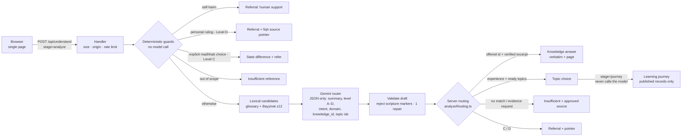

# طمأنينة — ملخص النظام | Tamaninah — System Overview

> هذا الملف يصف البنية **الحالية** للمشروع. القواعد العلمية مأخوذة من `sources.pdf`
> («المرجعية والحزمة العلمية والبيانات»، نسخة 1448/3/20). This file describes the **current**
> architecture: one page, one API endpoint, one serverless function.

---

## بالعربية

### الفكرة

يكتب الإنسان ما يشغله بكلامه — شعورًا أو سؤالًا أو موقفًا — فيفهمه نموذج ذكاء اصطناعي ويصنّفه ويختار له
**معرّفات** من قوائم يرسلها الخادم، ثم يعرض الخادم محتوى إسلاميًا **محفوظًا مسبقًا ومراجَعًا** من المصادر
المعتمدة في الحزمة العلمية. النموذج لا يكتب آية ولا حديثًا ولا تفسيرًا ولا حكمًا ولا مرجعًا.

### مكوّنات المنتج

| المكوّن | المسار | الدور |
|---|---|---|
| صفحة واحدة | `/` (`index.html` → `src/App.tsx`) | الصفحة التعريفية والتجربة في صفحة واحدة؛ حالات التجربة في `src/ExperienceViews.tsx` |
| نقطة API واحدة | `POST /api/understand` | مرحلتان: `analyze` (فهم وتوجيه) و`journey` (رحلة تعلّم من الكتالوج فقط) |
| دالة Netlify | `netlify/functions/understand.mts` | تستدعي المعالج المشترك `server/http/understand.ts` |
| خادم التطوير | `server/understandPlugin.ts` | نفس المعالج داخل Vite (`npm run dev` / `preview`) |

لا توجد مسارات أخرى: أي مسار غير موجود يعيد غلاف الصفحة نفسها (حالة 404).

### حالات التجربة (`src/ExperienceViews.tsx`)

الكتابة الحرة ← «أقرأ كلامك…» (`Thinking`) ← واحدة من:

- **اختيار موضوع** (`TopicChoice`): قراءة محايدة لما كتبه + موضوعات جاهزة من الكتالوج.
- **رحلة تعلّم** (`GuidanceResult`): نواة ثابتة — آية (Quranpedia)، ثم تفسيرها (الطبري)، ثم حديث من الصحيحين، ثم موقف من السيرة (ابن هشام أو روايات الصحيحين) — ثم خطوة عملية. وإذا طلب الشخص أن يتعلّم أكثر تُضاف فوق النواة أقسام حرفية من موسوعة الجمهرة (`lessons`)، أو يُصرَّح بأن الجزء المطلوب غير مغطّى (`learning_request.covered=false`).
- **إجابة معرفية** (`KnowledgeView`): صف من قاموس الحزمة العلمية أو مقتطف حرفي من «بينات» مع رقم المسألة والصفحة.
- **إحالة** (`ReferralView`): دعم بشري (إيذاء النفس) أو أهل العلم (المستوى ج/د) مع المصدر المعتمد للمعلومة العامة.
- **مرجع غير كافٍ** (`InsufficientView`): تصريح بعدم وجود نص مطابق + أين يُبحث في المصادر المعتمدة.
- **غير واضح** (`UnclearView`) و**خطأ** (`ErrorView`) مع إعادة المحاولة.

### مسار الطلب

1. **حواجز حتمية بلا نموذج**: إيذاء النفس ← إحالة لدعم بشري؛ حكم شخصي (المستوى د) ← إحالة مع مصدر الفقه العام؛
   خارج النطاق ← مرجع غير كافٍ؛ طلب صريح للترجيح بين المذاهب (المستوى ج) ← بيان الخلاف والإحالة.
2. **مرشحات معرفية**: بحث لفظي (تطبيع عربي + جذور + كلمات مفتاحية منسّقة) في القاموس و«بينات» — حتى 12 مرشحًا.
3. **نموذج التوجيه** (Gemini عبر واجهة متوافقة مع OpenAI): يعيد JSON فقط — ملخص محايد، المستوى (أ–د)، الأمان،
   النية، المجال، `knowledge_id` من المرشحات، و`suggested_topics` من الموضوعات الجاهزة.
4. **تحقق**: رفض أي مسودة تحمل علامات نص شرعي (﴿ ، «قال رسول»، «رواه»، أرقام آيات…) ومحاولة إصلاح واحدة للـJSON.
5. **قرار الخادم (`server/ai/analyzeRouting.ts`)**: الخادم هو صاحب القرار — يرفع المستوى بحواجزه، ويقبل فقط
   معرّفًا عرضه هو، ويحوّله إلى نص حرفي محفوظ، ويحيل ما كان ج/د، ويجيب عن طلب «دليل» بلا مطابقة بمرجع غير كافٍ.
6. **مرحلة الرحلة**: لا تستدعي النموذج أبدًا؛ تعيد بناء المستوى على الخادم وتُخرج المحتوى المنشور فقط.

### المزوّد والمهلة

قائمة نماذج مرتبة (`AI_MODEL`) مع انتقال فوري عند 404/429/5xx، وبدء النموذج التالي بعد 2.5 ثانية إن تأخر الأول،
وكل ذلك تحت مهلة واحدة مشتركة 18 ثانية (حد الدوال المتزامنة على Netlify 60 ثانية). المفتاح على الخادم فقط وبلا بادئة `VITE_`.

### الحماية

POST فقط، جسم ≤ 8 KB، رسالة ≤ 2000 حرف، نفس الأصل فقط (بلا CORS)، حد 20 طلبًا/دقيقة لكل IP (في الذاكرة)،
رؤوس أمان وCSP في `netlify.toml`، والسجلات تحفظ النتيجة والزمن فقط — لا نص المستخدم.

---

## English

### Components

| Component | Where | Role |
|---|---|---|
| Single page | `/` (`index.html` → `src/App.tsx`) | Landing + experience on one page; experience states in `src/ExperienceViews.tsx`; copy in `src/copy.ts` |
| Browser client | `src/understand.ts` | `POST /api/understand`, 20 s client timeout, maps responses to screens |
| One endpoint | `POST /api/understand` | `stage: "analyze"` (understand + route) and `stage: "journey"` (repository-only learning journey) |
| Handler | `server/http/understand.ts` | Validation, same-origin check, rate limit, deadline, logging (outcome + latency only) |
| Netlify Function | `netlify/functions/understand.mts` | Production entry (`config.path = "/api/understand"`) |
| Dev / preview | `server/understandPlugin.ts` | Same handler as Vite middleware |
| Orchestrator | `server/ai/orchestrate.ts` | Guards → candidates → model → validation → `resolveAnalyzeRoute` |
| Routing policy | `server/ai/analyzeRouting.ts` | Server-authoritative route decision |
| Provider | `server/ai/openaiProvider.ts` | OpenAI-compatible Chat Completions with ordered model fallback, hedging, one shared deadline |
| Prompts | `server/ai/prompts.ts` | Router-only system prompt grounded in the PDF's scope and levels (Arabic, verbatim) |
| Knowledge | `server/content/knowledge/*` | `sourcesPdf.ts` (PDF transcription), Bayyinat index + verified excerpts, lexical retrieval |
| Catalog | `server/content/*` | Topics, published records, provenance, source registry (allowlist), level guards, Qur'an snapshot |
| Wire contract | `shared/experience/api.ts` | Request/response types shared by browser and server |

There are no other routes. Any unknown path serves the same app shell with a 404 status.

### Request flow

### Analyze stage, step by step

1. **Deterministic guards** (`orchestrate.ts`, `content/levelGuard.ts`, `content/scopeGuard.ts`) run first and need
   no model — they still work when no AI key is configured.
2. **Candidates**: `knowledgeBase.findCandidates()` — normalized Arabic, light stemming, curated Arabic/English keywords,
   explicit "what does X mean / translate X" glossary detection; at most 12 candidates are sent to the model.
3. **Model** (`prompts.ts`): the system prompt embeds the PDF's scope and A–D level table verbatim; the model returns
   one JSON object. It is told never to answer, quote, paraphrase or translate religious text.
4. **Validation** (`shared/experience/validate.ts`): schema checks, scripture-marker rejection, one JSON-repair call
   if time remains under the shared deadline.
5. **Routing** (`analyzeRouting.ts`): level escalation by server guards; a `knowledge_id` is accepted only if the
   server offered it; it is resolved to verbatim stored text, or to a *restricted* (C/D → referral) or *index-only*
   (→ pointer to the exact Bayyinat question and page) result; requests for proof text with no match → insufficient
   + the PDF's approved source for the domain; topics are filtered to *ready* topics and titled from the catalog.

### Journey stage

`runJourney` never calls the model. It recomputes the level on the server (the client's level can only be raised),
resolves the topic's learning pack (Qur'an item required; explanation, hadith, hadith explanation and story only if
published), and returns a payload with **no free text**.

### Provider behaviour

- `AI_MODEL` is an ordered list. 404 (retired), 408/429 (busy/quota) and 5xx move to the next model immediately; a
  slow model is hedged after `AI_HEDGE_AFTER_MS` (2.5 s); the first usable answer wins.
- One shared deadline (`AI_DEADLINE_MS`, default 18 s) covers fallbacks, retries and JSON repair; Netlify synchronous
  functions may run up to 60 s.
- A second pass of the same busy model (429/5xx) waits 0.8 s first, never past the deadline minus 0.9 s.
- `reasoning_effort` is sent only when `AI_REASONING_EFFORT` is set (`low` for Gemini). A 400 to a request carrying it
  is retried once without it; the model is remembered as rejecting it only if the error names it or the retry succeeds
  (otherwise the 400 is an ordinary failure). 401/403 stop at once.

### Content at runtime

All religious content is bundled into the function as JSON/TS modules: the PDF transcription, the Bayyinat index and
excerpts, the published catalog records and the Qur'an snapshot. **Zero network calls for content at runtime.** The
Qur'an snapshot is replayed through the publish pipeline at cold start and every record must match its fingerprint.

### Errors the UI can show

`unclear`, `insufficient_reference` (+ pointer), `referral_required`, `timeout`, `upstream`, `invalid`, `unconfigured`,
`rate`, `text`, `body`, `method`, `forbidden` — each mapped to a calm screen with a retry or edit action. Without an
API key the API returns `unconfigured` (the deterministic guards still run); `AI_MOCK=true` exists for tests only.

### Security & privacy

POST only · JSON body ≤ 8 KB · message ≤ 2000 chars · same-origin only (no CORS) · 20 requests/min/IP (in-memory,
best-effort per instance) · CSP and security headers in `netlify.toml` · `Cache-Control: no-store` on API responses ·
logs contain stage, outcome, status and latency only — never the user's text · no accounts, no database, no cookies.

See also: [`../README.md`](../README.md), [`CONTENT-GOVERNANCE.md`](CONTENT-GOVERNANCE.md),
[`OPERATIONS.md`](OPERATIONS.md), [`SOURCES.md`](SOURCES.md), [`EVALUATION.md`](EVALUATION.md).
